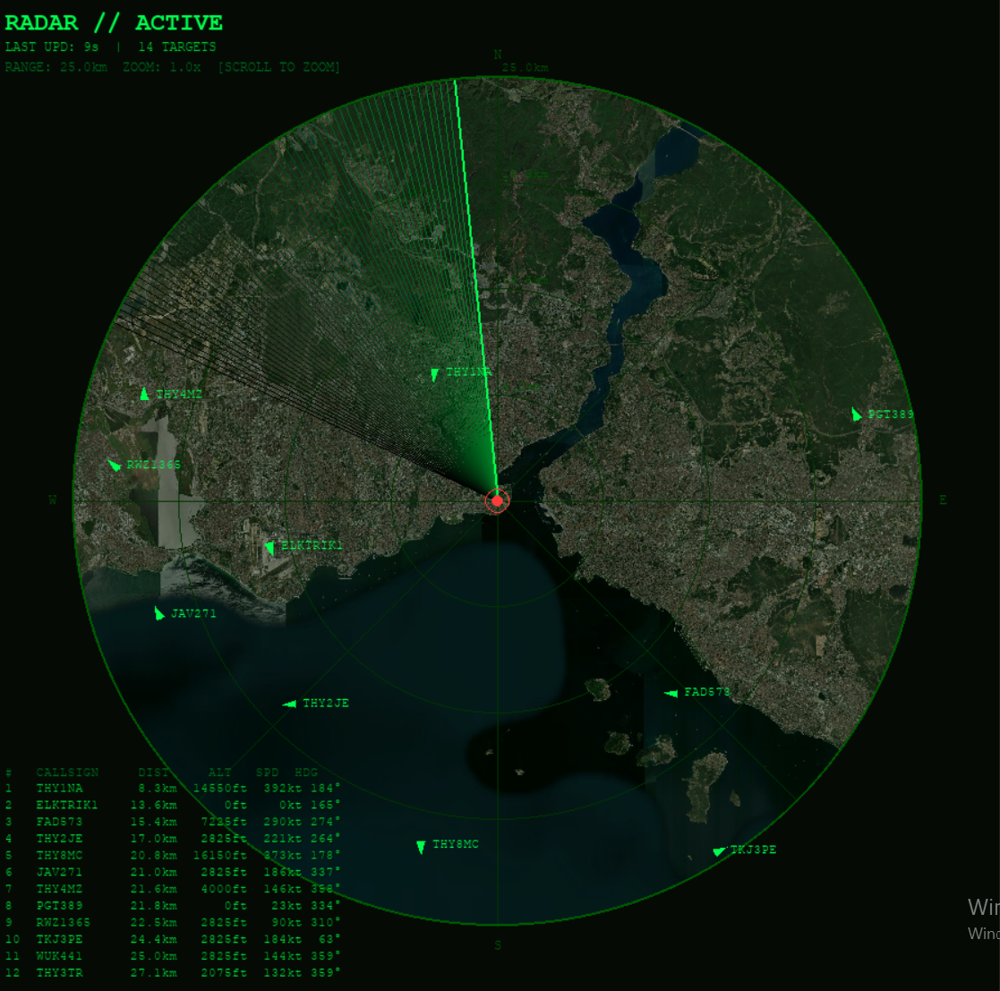

# 📡ADSB Live Flight Radar Viewer(kinda vibe coded)

An interactive, high-performance tactical radar screen built in Python using Pygame. This application captures real-time transponder data from active commercial and private aircraft via the FlightRadar24 API, calculating relative distances and headings from a custom home base, and rendering them over dynamically cached satellite map tiles.

---

## 🖼️ Interface Showcase


*Real-time interface rendering targets with trailing sweep phosphor degradation and dynamic overlay tints.*

---

## 🧠 System Architecture & Mechanics

To achieve 60 FPS performance without lagging during network calls, the application is divided into three asynchronous layers:

### 1. The Threaded Data Fetch Loop
The script boots a background daemon thread dedicated entirely to API requests. Every 10 seconds, it queries a bounding box calculated around your home coordinates. The raw flight metrics are processed through geodesic equations and stored safely inside a thread-locked shared data list.

* **Distance (Haversine Formula):** Calculates the great-circle distance across the Earth's curvature between your station and the aircraft:
    $$d = 2R \arcsin\left(\sqrt{\sin^2\left(\frac{\Delta \text{lat}}{2}\right) + \cos(\text{lat}_1)\cos(\text{lat}_2)\sin^2\left(\frac{\Delta \text{lon}}{2}\right)}\right)$$
* **Bearing:** Computes the absolute compass heading ($0^\circ$ to $359^\circ$) from your station to the target to position it accurately on the polar grid.

### 2. Multi-Threaded Tile System (`ThreadPoolExecutor`)
Instead of loading massive map images, the application converts your current GPS coordinates and zoom level into standard OpenStreetMap/ArcGIS map tile coordinates ($X, Y, Z$). 
A thread pool containing up to 8 parallel workers downloads missing satellite imagery chunks directly into a local folder (`tile_cache/`). The main loop checks this cache every frame—if a tile isn't ready yet, it draws a dark placeholder so the screen never flashes or freezes.

### 3. The Pygame Render & Blit Engine
* **Radar Sweep:** A dynamic vector line rotates at a constant angular velocity. A trail of 60 individual segments is drawn behind it with decreasing Alpha (transparency) channels to replicate a vintage CRT cathode screen.
* **Target Selection:** A robust tracking system indexes active flights by their string `callsign`. Clicking a target binds a persistent diagnostics HUD box on the bottom right.

---

<h3>📦 Core Dependency Deployment</h3>

<p align="left">
  <a href="https://pypi.org/project/pygame/">
    
  </a>
  <a href="https://pypi.org/project/FlightRadarAPI/">
    
  </a>
</p>

3. Verify Your Project Directory Structure

Before launching, ensure your local directory contains the following configuration, asset, and safeguard files exactly like this:


### 3. Verify Your Project Directory Structure
Before launching, ensure your local directory contains the following configuration, asset, and safeguard files exactly like this:

```text
📂 project-root/
├── 🐍 adsb_viewer.py          # The core Python radar script
├── ⚙️ config.json             # local private coordinate file(you need to create)
├── ⚙️ config.example.json     # Public template file
├── 📝 README.md               # Documentation and system guide
└── 🖼️ screenshot.png          # UI display image
⚙️ Configuration & Deployment

Step 1: Create Your Private Config
The repository blocks config.json via .gitignore to protect coordinates. Create your local config by copying the example template:

Windows PowerShell:
Copy-Item config.example.json config.json

Linux / macOS Terminal:
cp config.example.json config.json

Step 2: Edit Your Target Location
Open the newly created config.json file and replace the values with your station's specific data:

{
    "MY_LAT": 51.5074,
    "MY_LON": -0.1278,
    "RADIUS_KM": 25,
    "RADAR_NAME": "RADAR // LONDON STATION"
}

🎮 Interface Controls
Mouse Scroll Wheel: Zoom the radar scale dynamically inward or outward. The tile system automatically fetches higher or lower altitude satellite resolutions based on your scale.

Left Mouse Click: Hover over any aircraft vector icon and click to lock onto it. This populates the advanced tracking telemetry box. Click again to clear.

F11: Toggle display between Windowed mode and Fullscreen.

ESC: Close the radar screen immediately and terminate background network threads cleanly.

And Now you are fully ready to use this ADS-B viewer
be advised that this is only for EDUCATIONAL PURPOSES
